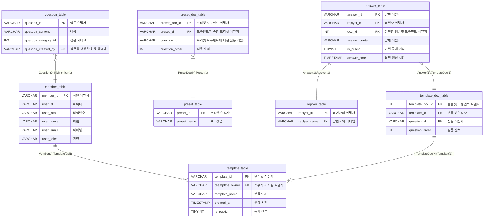

# TenQuest-BE
Repository for TenQuest service

# ERD

# Updates 
**23.03.17** - [Response 관련 업데이트 내용](https://github.com/TenQuest-Team/TenQuest-BE/blob/develop/updates/230317%20-%20Response%20%EA%B4%80%EB%A0%A8%20%EC%97%85%EB%8D%B0%EC%9D%B4%ED%8A%B8%20%EB%82%B4%EC%9A%A9.md)
